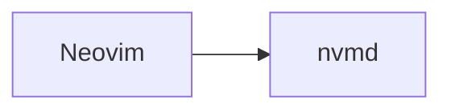

# nvmd

Lightweight native Markdown preview for Neovim.

`nvmd` is a small native preview window for Markdown files. Neovim remains the editor; `nvmd` opens beside it, renders the current file, watches for saves, and reloads the preview.

## Why

Most Markdown preview flows either open a browser tab or embed browser technology. `nvmd` is intentionally native: Rust, `egui`, `pulldown-cmark`, `notify`, and native Mermaid rendering. No Electron, no WebView, no browser process.

## Run

```sh
cargo run -- README.md
```

The preview launches as a detached process, so the terminal prompt returns immediately.

```sh
cargo run -- --help
```

## Neovim Plugin

The plugin uses prebuilt release binaries, so users do not need Rust unless they want to build from source. With `packer.nvim`:

```lua
use {
  "ryuux05/nvmd",
  run = "sh scripts/install-binary.sh",
  config = function()
    require("nvmd").setup({
      live_reload = true,
      debounce_ms = 150,
    })
  end,
}
```

With `lazy.nvim`:

```lua
{
  "ryuux05/nvmd",
  build = "sh scripts/install-binary.sh",
  config = function()
    require("nvmd").setup({
      live_reload = true,
      debounce_ms = 150,
    })
  end,
}
```

Run `:PackerSync` (or `Lazy sync`), open a Markdown file, and use `:NvmdOpen`.

Available commands:

- `:NvmdOpen` — open a viewer for the current buffer, a file argument, or the filename under the cursor
- `:NvmdClose` — close that file's viewer
- `:NvmdToggle` — toggle the viewer
- `:NvmdRefresh` — republish cursor position or open if closed
- `:NvmdInstallBinary` — download the matching prebuilt binary
- `:NvmdBuild` — build from source with `cargo build --release`

## Keyboard Shortcuts

Press `:` in the preview window to open the command palette.

| Key | Action |
|-----|--------|
| `j` / `k` | Scroll down / up |
| `/` | Open in-document search |
| `T` | Toggle table of contents sidebar |
| `:` | Open command palette |
| `q` | Close the viewer |
| `Esc` | Toggle settings / exit Mermaid control |
| `Space j/k` | Select next / previous Mermaid diagram |
| `Enter` | Open selected Mermaid diagram in large view |
| `h/j/k/l` | Pan inside Mermaid canvas |
| `[` / `]` | Zoom out / in Mermaid diagram |
| `f` | Fit Mermaid diagram to viewport |

All keys except `Esc` and `Enter` are remappable via `~/.config/nvmd/config.toml`.

### Search

Press `/` to open the search bar at the bottom of the window. Matching blocks are highlighted with an accent bar. Press `n` / `N` to cycle through matches, `Enter` to confirm and scroll, `Esc` to close.

### Table of Contents

Press `T` to toggle a sidebar listing all headings. Click any heading to scroll the document to that section. The sidebar updates automatically on document reload.

## Configuration

Settings are stored in `~/.config/nvmd/config.toml`. Edit it directly or use the in-app settings panel (`Esc` to open).

```toml
# Theme: "Dark" or "Light"
preset = "Dark"

# Window size on next launch
window_width = 1280.0
window_height = 900.0

# Enable Mermaid rendering by default (--no-mermaid CLI flag still overrides)
enable_mermaid = true

# Document layout
page_max_width = 1012.0
page_inner_margin = 32.0
line_height = 1.5
paragraph_gap = 16.0

# Typography
body_font_size = 16.0
code_font_size = 13.6

# Keybindings — single characters or named keys: "space", "enter", "escape", ":"
[keys]
scroll_down = "j"
scroll_up = "k"
palette = ":"
quit = "q"
toc = "t"
search = "/"
```

## Markdown Support

- Headings (H1–H6) with proportional sizing
- Paragraphs with configurable line height and spacing
- **Bold**, *italic*, ~~strikethrough~~, `inline code`
- Fenced code blocks with **syntax highlighting** (Rust, Python, JS/TS, Go, Bash, JSON, TOML, YAML, and more via syntect)
- Bullet lists, ordered lists, and **task list checkboxes** (`- [x]` / `- [ ]`)
- Blockquotes with accent border
- Horizontal rules
- Tables with alternating row stripes
- **Images** — local file paths are loaded and rendered inline; alt text shown as caption
- **Hyperlinks** — `http://`, `https://`, and `mailto:` links open in the default browser on click
- Mermaid fenced code blocks (see below)
- Footnotes, definition lists, HTML blocks (shown as source), math blocks (shown as source)

## Mermaid Support

Mermaid blocks are detected from fenced code blocks:

````markdown

````

Rendering uses `mermaid-rs-renderer` natively. SVG is rasterized with `resvg`/`usvg`/`tiny-skia`. Renders are bounded to 4 concurrent jobs and cancelled automatically on document reload to avoid stale work on large files.

Diagram controls when a Mermaid block is selected:

- `Enter` — open in large resizable view; press again to grow step by step
- `h/j/k/l` — pan the canvas
- `[` / `]` — zoom
- `f` — fit to viewport
- `Esc` — close large view

## Code Block Features

- **Copy button** — hover over any code block to reveal a "copy" button in the top-right corner; clicking it copies the raw source to the clipboard and shows a ✓ confirmation for 1.4 seconds
- **Syntax highlighting** — colors powered by syntect with built-in themes that match the active dark/light preset

## Themes

Two built-in presets:

- **Dark** — deep navy/blue palette inspired by Tokyo Night
- **Light** — clean white/grey palette

Switch with `:theme` in the command palette, the ☀/☾ toggle in the settings panel, or by setting `preset = "Light"` in `config.toml`.

## Cursor Follow

While a viewer is open, moving the Neovim cursor scrolls the preview to the corresponding rendered block. Entering a Mermaid fenced block also focuses that diagram for keyboard controls.

By default, the plugin previews unsaved buffer edits after a short `150ms` pause. Set `live_reload = false` to preview only saved file changes.

## Non-goals

`nvmd` does not use Electron, Chromium, WebView, browser windows, Node.js, npm, Puppeteer, Mermaid CLI, or `mmdc`.
