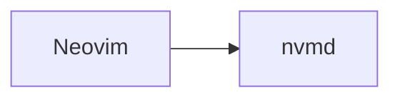
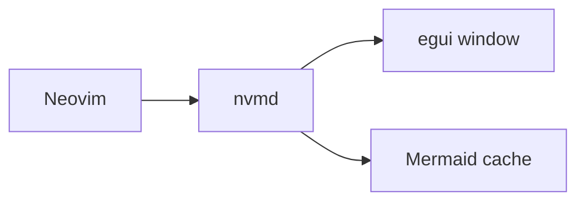

# nvmd

Lightweight native Markdown preview for Neovim.

`nvmd` is a small native preview window for Markdown files. Neovim remains the editor; `nvmd` opens beside it, renders the current file, watches for saves, and reloads the preview.

## Why

Most Markdown preview flows either open a browser tab or embed browser technology. `nvmd` is intentionally native: Rust, `egui`, `pulldown-cmark`, `notify`, and native Mermaid rendering.

## Run

```sh
cargo run -- README.md
```

The preview launches as a detached process, so the terminal prompt returns immediately.

Help:

```sh
cargo run -- --help
```

## Neovim Plugin

The plugin can use prebuilt release binaries, so users do not need Rust unless
they want to build from source. With `packer.nvim`:

```lua
use {
  "ryuux05/nvmd",
  run = "sh scripts/install-binary.sh",
  config = function()
    require("nvmd").setup({
      live_reload = true,
      debounce_ms = 150,
    })
  end,
}
```

Run `:PackerSync`, open a Markdown file, and use `:NvmdOpen`. You can also
place the cursor over a Markdown filename in a file picker or file explorer and
run `:NvmdOpen` without opening that file first.

With `lazy.nvim`:

```lua
{
  "ryuux05/nvmd",
  build = "sh scripts/install-binary.sh",
  config = function()
    require("nvmd").setup({
      live_reload = true,
      debounce_ms = 150,
    })
  end,
}
```

Set `binary = "/custom/path/to/nvmd"` only when overriding the automatically
detected release binary or using a separately installed executable.

Available commands:

- `:NvmdOpen` opens a viewer for the current Markdown buffer, an optional file
  argument, or the Markdown filename under the cursor.
- `:NvmdClose` closes that file's viewer.
- `:NvmdToggle` toggles that file's viewer.
- `:NvmdRefresh` republishes the cursor position or opens the viewer if needed.
- `:NvmdInstallBinary` downloads the matching prebuilt binary from the latest
  GitHub release.
- `:NvmdBuild` runs `cargo build --release` inside the installed plugin
  directory when building from source.

If `:NvmdOpen` reports that the binary is missing, run `:NvmdInstallBinary`,
`:PackerSync`, or your plugin manager's rebuild command. Building from source
with `:NvmdBuild` requires Rust/Cargo.

While a viewer is open, moving the Neovim cursor scrolls the preview to the
corresponding rendered block. Entering a Mermaid fenced block also focuses that
diagram for keyboard controls in the viewer.

By default, the plugin previews unsaved buffer edits after a short `150ms`
pause in typing. Set `live_reload = false` to preview only saved file changes;
cursor-follow synchronization continues in either mode.

## Current Markdown Support

- Headings
- Paragraphs
- Fenced code blocks
- Bullet lists
- Ordered lists
- Blockquotes
- Horizontal rules
- Mermaid fenced code blocks

Unsupported Markdown is ignored or shown as readable fallback content rather than crashing.

## Mermaid Support

Mermaid blocks are detected from fenced code blocks:

````markdown

````

Rendered example:



Rendering uses `mermaid-rs-renderer` natively and stores cached SVG files in the platform cache directory through `directories`. The SVG is rasterized with `resvg`/`usvg`/`tiny-skia` for display in `egui`.

Mermaid compatibility is intentionally lightweight in V1. Unsupported diagram types or renderer failures are shown inline as an error with the original source block.

## Viewer Commands

Press `:` in the preview to open the command palette. Available commands include `:help`, `:settings`, `:reload`, `:top`, `:bottom`, `:mnext`, `:mprev`, `:mopen`, `:fit`, `:zoom-in`, `:zoom-out`, and `:q`.

When a Mermaid diagram is selected, press `Enter` to open it in a large resizable view; press `Enter` again to enlarge it step by step until it fills the available window. Use `h/j/k/l` to pan around its whiteboard canvas, `[` / `]` to change zoom, and `f` to center and fit the complete diagram in the view. Use `Space j` and `Space k` to select or switch diagrams, including while the large view is open; press `Esc` to close it.

## Roadmap

- Bidirectional source navigation from the preview
- Syntax highlighting
- Image rendering
- Table support
- Themes
- Config file
- Better Mermaid compatibility
- Async Mermaid render queue

## Non-goals

`nvmd` does not use Electron, Chromium, WebView, browser windows, Node.js, npm, Puppeteer, Mermaid CLI, or `mmdc`.
